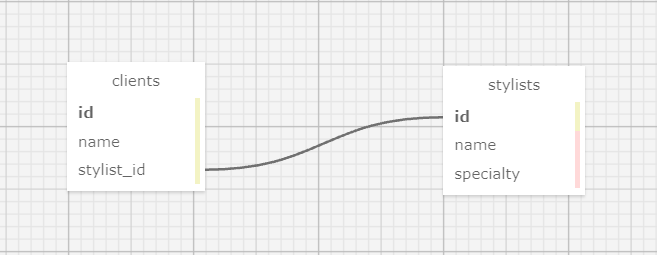

# Hair Salon

### By Marni Sucher, 10.19.21

## Description 
_Epicodus Independent Project to demonstrate the usage of a one to many relationships where stylists have specialities and each can have many clients_

## Technologies Used
* _C#_
* _Entity_
* _.NET 5 SDK_
* _MySQL_
* _MySQL Workbench_
* _Razor_
* _ASP.NET Core MVC_
* _LINQ_

## Schema

## Setup/Installation
1. Clone repository to your Desktop: _git clone https://github.com/marnionrails/HairSalon.Solution_
2. Navigate to the directory: From the Desktop directory, execute _cd HairSalon.Solution_
3. Open in vs code: _code ._
4. Install the project dependencies: Navigate to HairSalon and execute _dotnet restore_
5. Import the dumpfile database:  
  a. Open MySQL Workbench  
  b. Go to Navigator > Administration > select Data Import/Restore  
  c. Go to Import Options > select Import from Self-Contained File  
  d. Click the button with the 2 dots to the right  
  e. Locate the HairSalon project folder and select the dump file: marni_sucher.sql  
  f. Click Ok  
  g. Go to Import Progress > click Start Import in bottom right corner  
  h. Go to Navigator > Schemas tab > right click and select Refresh all  
  i. The database will now appear.  
6. Now, we need to create a connection string so our program has access to the database.  
  a. Go to HairSalon.Solution and create this file: appsettings.json  
  b. Add this code to the empty file (omit the brackets enclosing the username and password):  
  {  
    "ConnectionStrings": {  
        "DefaultConnection": "Server=localhost;Port=3306;database=marni_sucher;uid=[YOUR-USERNAME-HERE];pwd=[YOUR-PASSWORD-HERE];" 
    } 
}
7. To use this program in the browser, go to HairSalon directory > execute "dotnet run"

## Known Bugs
* none at this time

## License 
GPL

## Contact
Marni Sucher <suchermarni@gmail.com>